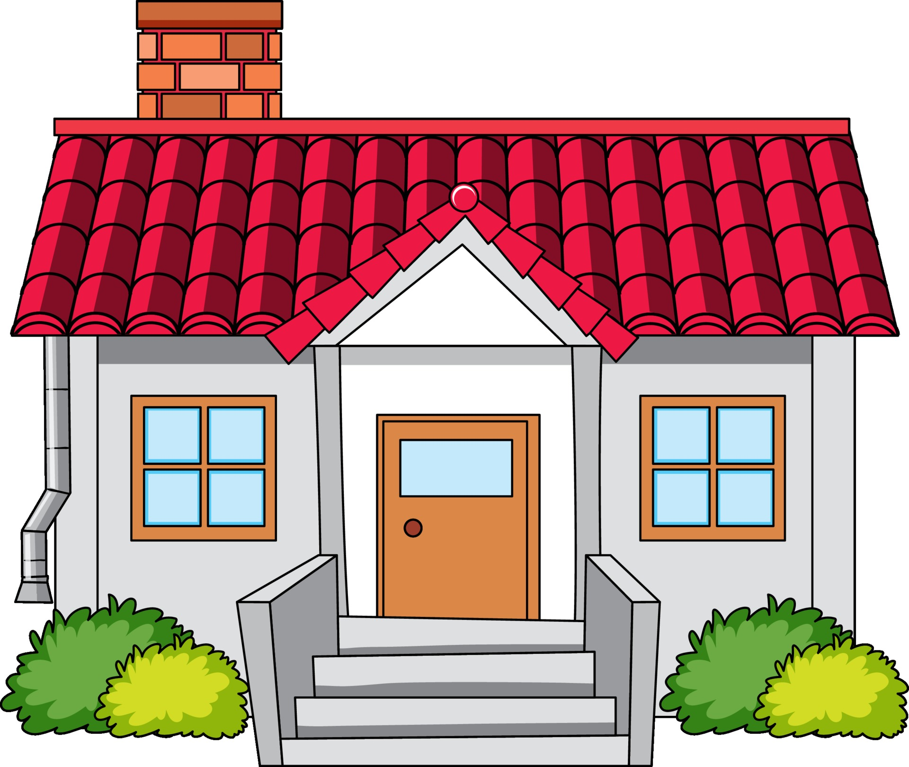

<!DOCTYPE html>
<html lang="es">
<head>
  <meta charset="utf-8" />
  <meta name="viewport" content="width=device-width, initial-scale=1" />
  <title>IAprendo - Aprende a Leer y Escribir</title>
  <link rel="stylesheet" href="estilo.css">
  
</head>
<body>
  <header>
    <h1>
      
      IAprendo
    </h1>
    
Aprende a leer y escribir con ayuda de tu voz

    <button class="btn" id="toggleMode" style="position:absolute;top:20px;right:20px;">🌙 Modo oscuro</button>
  </header>

  <!-- Reconocimiento de letras -->

  <!-- Abecedario con sonidos -->
  <section>
    <h2>🔠 Abecedario con sonidos</h2>
    

      <strong>Instrucción:</strong> Haz clic en cada letra para escuchar su sonido y una palabra de ejemplo.
      <button class="btn" id="vozAbecedario" title="Escuchar instrucción">🔊</button>
    

  

  </section>

  <!-- Escribir con ayuda de voz -->
  <section>
    <h2>✍️ Pronuncie su nombre</h2>
    

      <strong>Instrucción:</strong> Escribe tu nombre en el cuadro o haz clic en el micrófono para decirlo. Luego presiona el botón de altavoz para escucharlo o el botón de letras para escucharlo deletreado.
      <button class="btn" id="vozNombre" title="Escuchar instrucción">🔊</button>
    

    

      <input type="text" id="nameInput" placeholder="Diga o escriba su nombre aquí" autocomplete="off" />
      <button class="btn" id="readName" title="Escuchar nombre">🔊</button>
      <button class="btn" id="spellName" title="Deletrear nombre">🔡</button>
      <button class="btn" id="speakBtn" title="Decir nombre con micrófono">🎤</button>
    

  </section>

  <!-- Pequeño texto para lectura -->
  <section>
    <h2>📖 Practica la lectura</h2>
    

      <strong>Instrucción:</strong> Lee la frase en voz alta. Si quieres escucharla, haz clic en el botón "Escuchar" y ajusta la velocidad si lo necesitas.
      <button class="btn" id="vozLectura" title="Escuchar instrucción">🔊</button>
    

    
<em>El   sol   brilla   en   el   cielo.</em>

    <button class="btn" data-sound="El sol brilla en el cielo">🔊 Escuchar</button>
    <label for="velocidadLectura">Velocidad de lectura:</label>
    <input type="range" id="velocidadLectura" min="0.2" max="2" step="0.1" value="1" style="width:150px;">
    1x
  </section>

  <!-- Tarea: Escribe las vocales -->
  <section>
    <h2>✏️ Tarea: Escribe las vocales</h2>
    

      <strong>Instrucción:</strong> Escribe las vocales en orden (A, E, I, O, U) en el cuadro y presiona "Verificar" para saber si lo hiciste bien.
      <button class="btn" id="vozTarea" title="Escuchar instrucción">🔊</button>
    

    <input type="text" id="vocalesInput" placeholder="Escribe aquí..." autocomplete="off" />
    <button class="btn" id="verificarVocales">Verificar</button>
    
  </section>

  <!-- Agrega esto después de la sección de tarea de vocales -->
  <section>
    <h2>🧩 Ordena las vocales</h2>
    

      <strong>Instrucción:</strong> Arrastra las letras para ordernarlarlas correctamente de la A a la U.
      <button class="btn" id="vozOrdenaVocales" title="Escuchar instrucción">🔊</button>
    

    

    <button class="btn" id="verificarOrdenVocales">Verificar orden</button>
    
  </section>

  <section>
    <h2>🔎 Reconoce las consonantes</h2>
    

      <strong>Instrucción:</strong> Haz clic en todas las letras que sean consonantes.
      <button class="btn" id="vozConsonantes" title="Escuchar instrucción">🔊</button>
    

    

    <button class="btn" id="verificarConsonantes">Verificar</button>
    
  </section>

  <!-- Nueva sección para la tarea de imagen -->
  <section>
    <h2>🌳 Escribe el nombre de la imagen</h2>
    

      <strong>Instrucción:</strong> Observa la imagen y escribe su nombre en el cuadro. Presiona "Verificar" para saber si es correcto.
      <button class="btn" id="vozImagenPalabra" title="Escuchar instrucción">🔊</button>
    

    

      
    

    <input type="text" id="imagenPalabraInput" placeholder="¿Qué ves en la imagen?" autocomplete="off" />
    <button class="btn" id="verificarImagenPalabra">Verificar</button>
    <button class="btn" id="escucharImagenPalabra" title="Escuchar palabra">🔊</button>
    
  </section>

  <!-- Nueva sección para la tarea de imagen: CASA -->
  
  <section>
    <h2>🏠 Escribe el nombre de la imagen</h2>
    

      <strong>Instrucción:</strong> Observa la imagen y escribe su nombre en el cuadro. Presiona "Verificar" para saber si es correcto.
      <button class="btn" id="vozImagenCasa" title="Escuchar instrucción">🔊</button>
    

    

      
    

    <input type="text" id="imagenCasaInput" placeholder="¿Qué ves en la imagen?" autocomplete="off" />
    <button class="btn" id="verificarImagenCasa">Verificar</button>
    <button class="btn" id="escucharImagenCasa" title="Escuchar palabra">🔊</button>
    
  </section>

  <!-- Actividad final: Lectura y comprensión de un cuento corto -->
  <section>
    <h2>📚 Lee el cuento</h2>
    

      <strong>Instrucción:</strong> Lee atentamente el siguiente cuento corto.
      <button class="btn" id="vozCuento" title="Escuchar instrucción">🔊</button>
    

  

      
<strong>El viaje de Tomás</strong>

      
Tomás era un niño curioso que vivía en un pequeño pueblo. Un día, decidió explorar el bosque que estaba cerca de su casa. Llevó una mochila con agua, una manzana y su cuaderno de dibujos.

      
Mientras caminaba, Tomás escuchó el canto de los pájaros y vio mariposas de muchos colores. Se sentó bajo un árbol grande y dibujó todo lo que veía a su alrededor.

      
De repente, encontró una piedra brillante en el suelo. Tomás la recogió y pensó que era un tesoro especial. Decidió guardarla en su mochila para mostrársela a su mamá.

      
Al regresar a casa, Tomás le contó a su mamá todo lo que había visto y aprendido en el bosque. Ella sonrió y le dijo que cada día puede ser una nueva aventura si observamos con atención.

    

  </section>
    

  
</body>
</html>
